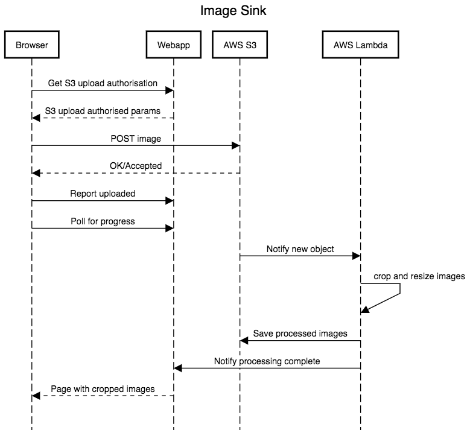

# Image Sink
[This project is deployed here](http://ec2-15-206-14-176.ap-south-1.compute.amazonaws.com/gallery/)

### Architecture components (aws)
- EC2 instance
  - Django
  - SQLite3
- S3
  - Single storage bucket for uploads as well as processed images
- Lambda 
  - running a function in a python3 environment

## Sequence diagram

