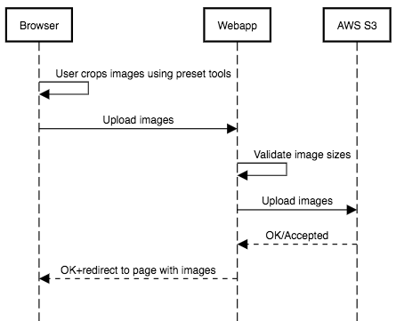

# Image Sink
[This project is deployed here](http://13.235.232.147/gallery/)

## Approach 1

[In this approach](http://ec2-15-206-14-176.ap-south-1.compute.amazonaws.com/uploader/), the cropping happens completely asynchronously in the backend. We have a minimal validation on the front end and an async validation in the backend.

### Deployment components (aws)
- EC2 instance
  - Django
  - SQLite3
- S3
  - Single storage bucket for uploads as well as processed images
- Lambda 
  - running a function in a python3 environment

### Ideal sequence

## Approach 2

[In this approach](http://ec2-15-206-14-176.ap-south-1.compute.amazonaws.com/uploader/precropped), the client crops all images as they wish. The images are then uploaded to the backend which validates and only then saves the images.

### Deployment components (aws)
- EC2 instance
  - Django
  - SQLite3
- S3
  - Single storage bucket for uploads
  
### Ideal sequence

